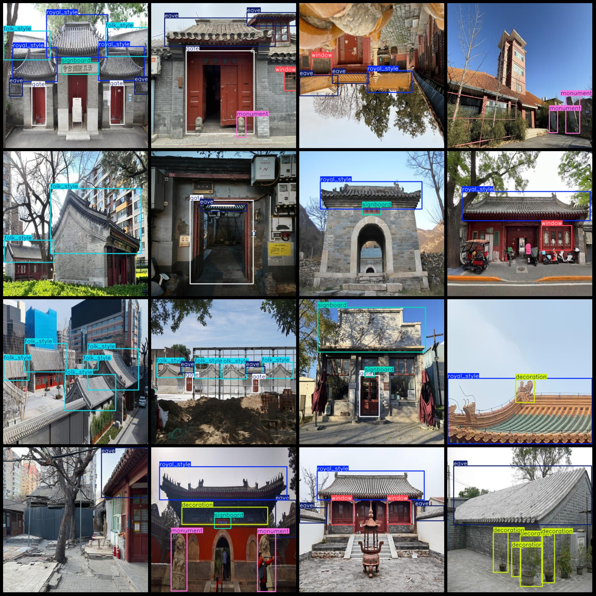
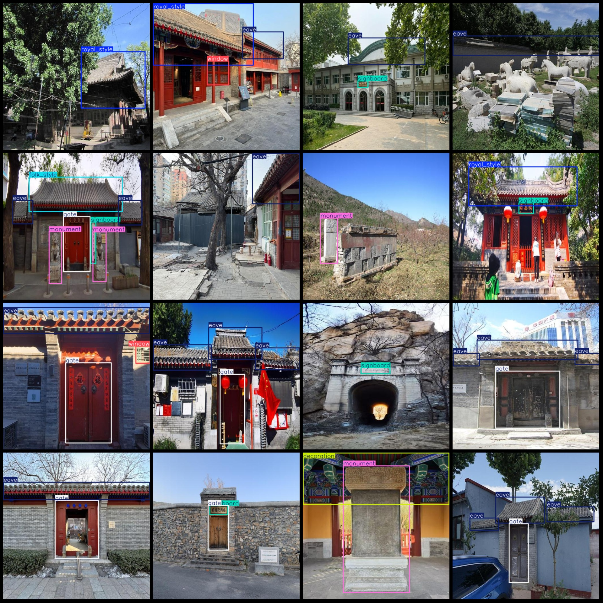

# Beijing Hutong Ancient Architecture Style Elements Detection Dataset: VOC+YOLO (1298 Images, 8 Classes)

**Dataset Format:** Pascal VOC format + YOLO format (txt file without segmentation paths, only containing jpg images along with corresponding VOC format xml files and YOLO format txt files).

- **Image Count (jpg Files):** 1298
- **Annotation Count (xml Files):** 1298
- **Annotation Count (txt Files):** 1298
- **Number of Annotation Categories:** 8
- **Annotation Category Names (Note: the order in the YOLO format might not match this, refer to the 'labels' folder's 'classes.txt'): ["decoration", "eave", "folk_style", "gate", "monument", 
"royal_style", "signboard", "window"]
- **Box Count for Each Category:**
    - **decoration (Decorative Components)**: 199 boxes
    - **eave (Roof Leaf)**: 1473 boxes
    - **folk_style (Folk Style)**: 779 boxes
    - **gate (Gate/Gallery)**: 611 boxes
    - **monument (Stone Monument)**: 289 boxes
    - **royal_style (Royal Style)**: 407 boxes
    - **signboard (Signboard)**: 533 boxes
    - **window (Window)**: 422 boxes
- **Total Boxes:** 4713
- **Image Resolution:** 512x512
- **Annotation Tool Used:** labelImg
- **Annotation Rules:** Draw a box around each category.
- **Important Notice:** The dataset does not have been divided into training, validation, or test sets; you should do so yourself.
- **Special Disclaimer:** This dataset does not guarantee any accuracy in the trained models or weight files.
- **Image Preview:**

## Images

Here is a pay link on Stripe ( https://buy.stripe.com/3cs8yP7sY87d0vu9AB ). Please contact me lonlonago@foxmail.com after funding $89, and I will send you a complete data files , thank you!

